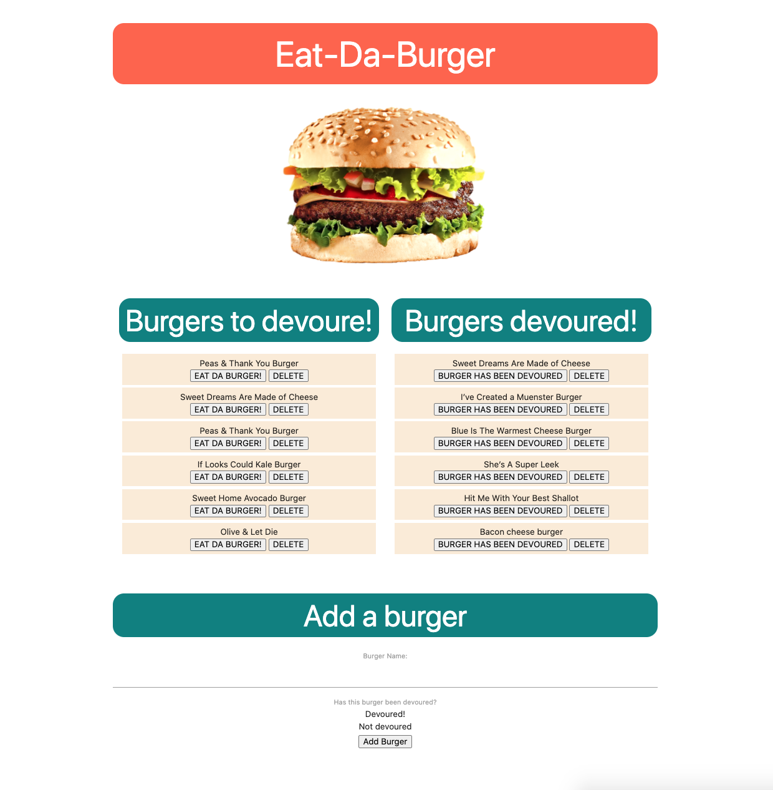

# Eat-Da-Burger
  

<a href="https://eat-da-burger-tp.herokuapp.com/">Click here to see it in action.</a>

## Table of Contents
* [Description](#description)
* [Installation](#installation)
* [Usage](#usage)
* [License](#license)
* [Contributions](#contributions)
* [Tests](#tests)
* [Questions](#questions)

## Description 
*Overview of this project:* 
* Eat-Da-Burger is a restaurant app that lets users input the names of burgers they'd like to eat.
* Whenever a user submits a burger's name, the app will display the burger on the left side of the page -- waiting to be devoured.
* Each burger in the waiting area also has a Devour it! button. When the user clicks it, the burger will move to the right side of the page.
* Eat-Da-Burger stores every burger in a database, whether devoured or not.

## Installation
*Steps required to install project and get the development environment established:*
* Simply clone the repo and type `npm install` into your command in your terminal to install all necessary packages. 
* You will need to use the schema to create the `burgers_db` on your own MySQL workbench. 
* You will need to seed the database with the seeds provided. 
* To launch the app type `node server` into your terminal.
* From there you will be able to see the app on your local machine at http://localhost:3000/.

## Usage
*Instructions and examples for use:* 
* The website has a title and burger image at the top of the page with three sections below.  
1. Burgers to Devoure section: 
    1. You can click on the burgers in this section to devoure them. 
    2. Once devoured the burger will move to the 'burgers devoured' section on the right of the page.   
    3. You can click delete to delete the burger all together. 
2. Burgers Devoured section:
    1. If you click on the 'burger has been devoured' button it will push it back over to the 'burgers to devoure' section on the left of the page. 
    2. If you clicke delete the burger will be removed from the page.   
3. Add burger section
    1. This is where users can add a burger of thier choosing to the list.
    2. User will type in a burger they would like to devoure. 
    3. Burger will entered into the database and will appear on the 'burgers to devoure' section.    

## License 
* Built under the MIT licence.

## Credits
* Built & designed by Tomara Petty.

## Test
* No tests required. 

## Questions?

 

#### If you have any questions or want to make a contribution please reach out to me here:
 

**GitHub:** 
@tomarapetty 
  

**Email:** 
tomararuth@gmail.com 
 

**LinkedIn:** 
https://www.linkedin.com/in/tomara-petty/ 

